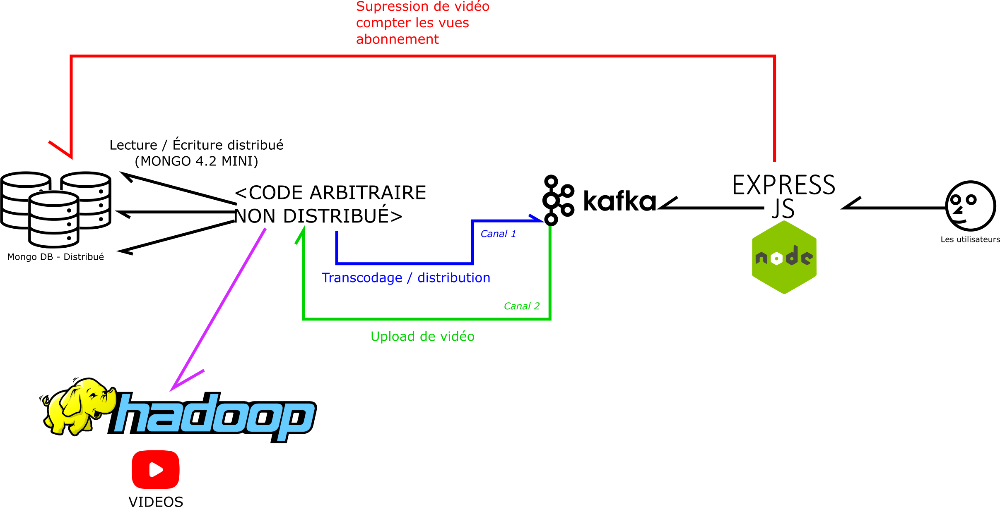
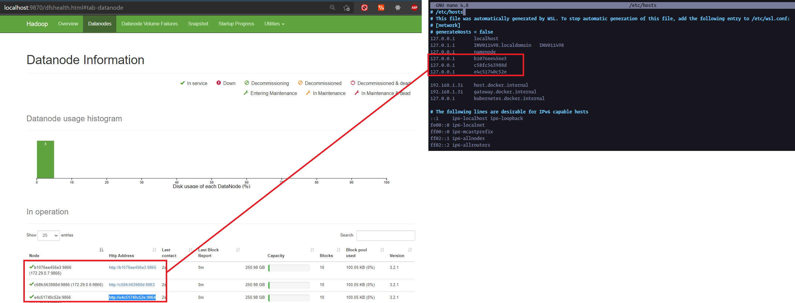

# ynov_tpfinal
Semi Distribued architecture for fake video upload 

Participants :
- Louis Charavner
- Thibauld Mouchon
- Clément Valette

## Attention
Pour utiliser le programme HDFS vous devez résoudre les noms des datanodes avec le fichiers `/etc/hosts/` (linux uniquement)

